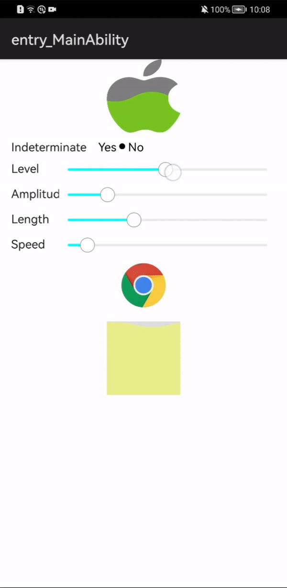

# WaveLoading
  WaveLoading: This library provides a wave loading animation as a Drawable Element.


 
## Usage Instructions

Create WaveDrawable Element with an Image or Image resource, and set it to component to provide waveloading animation effect.

```Java
    mImageView = (Image) findComponentById(ResourceTable.Id_image);
    mWaveDrawable = new WaveDrawable(getContext(), ResourceTable.Media_android_robot).attachComponent(mImageView);
    mImageView.setImageElement(mWaveDrawable);
```
   
  Other configurable APIs:
  
  * `public void setWaveAmplitude(int amplitude)`, set wave amplitude (in pixels)
  * `public void setWaveLength(int length)`, set wave length (in pixels)
  * `public void setWaveSpeed(int step)`, set wave move speed (in pixels)
  * `public void setIndeterminate(boolean indeterminate)`, like progress bar, if run
  in *indeterminate* mode, it'll increase water level over and over again, otherwise, you can
  use `boolean setLevel(int level)` to set the water level, acting as loading progress.
  * `public void setIndeterminateAnimator(AnimatorValue animator)`, set you customised animator
  for wave loading animation in indeterminate mode.
  
 ## Installation instruction

1. For using  module in sample app,include the below library dependency to generate hap/library.har:
Add the dependencies in entry/build.gradle as below :

      dependencies {
          implementation project(path: ':library')
        }

2. Using the waveLoading har, make sure to add library.har file in the entry/libs folder and add the below dependency
in build.gradle.
Modify the dependencies in the entry/build.gradle file.

    dependencies {
        implementation fileTree(dir: 'libs', include: ['*.jar', '*.har'])
  }
 
 ## License
  MIT


